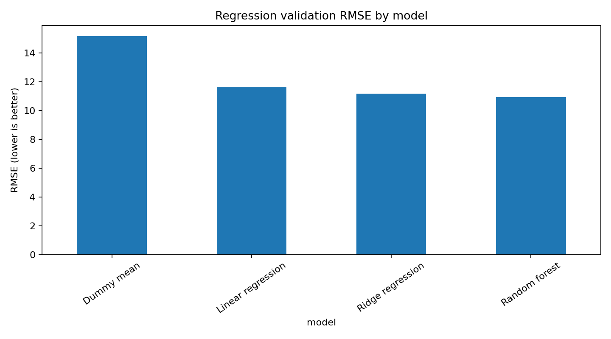
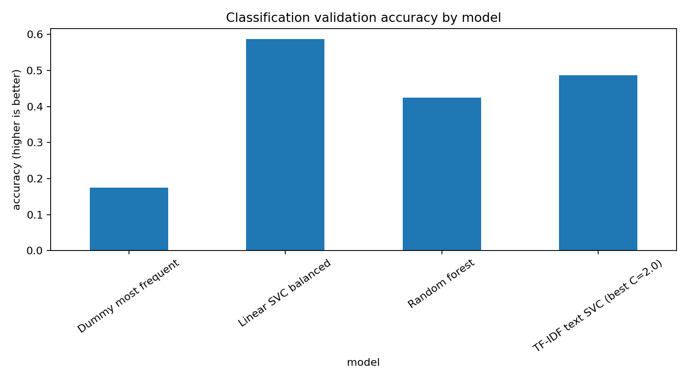

# Spotify Popularity and Genre Modelling

[](https://github.com/mati-wiecek/msc-ai-data-science-projects/actions/workflows/portfolio-ci.yml)

A compact machine-learning project for two related song-metadata tasks:

1. **Popularity regression** - predict a numeric song popularity score.
2. **Genre classification** - predict the song's top genre label.

The project is organised as a reproducible applied ML workflow: raw data is kept outside version control, file names are neutral, baseline models are compared before final model selection, and generated submissions are written only to the ignored `outputs/` directory.

## Results Snapshot

| Task | Final approach | Public benchmark result | Local validation signal |
|---|---|---:|---:|
| Popularity regression | CatBoost regression with categorical handling | RMSE **6.52657** | CatBoost quick validation RMSE **9.8633** |
| Genre classification | Linear SVC with balanced class weights | Accuracy **0.57142** | Validation accuracy **0.5875** |

The classification audit found that the tabular Linear SVC pipeline exactly matched the validated prediction file, while the optional TF-IDF text variant performed worse on the reproducible validation split. For that reason, the text variant is kept as an experiment rather than the default model.

## Visual Results

| Regression validation | Classification validation |
| --- | --- |
|  |  |

## Project Structure

```text
.
|-- README.md
|-- requirements.txt
|-- requirements-dev.txt
|-- pyproject.toml
|-- data/
|   |-- README.md
|   `-- raw/
|       `-- .gitkeep
|-- figures/
|   |-- classification_class_distribution.png
|   |-- classification_validation_accuracy.png
|   |-- regression_target_distribution.png
|   `-- regression_validation_rmse.png
|-- notebooks/
|   `-- spotify_popularity_genre_modelling.ipynb
|-- outputs/
|   |-- README.md
|   `-- .gitkeep
|-- reports/
|   |-- local_validation_metrics.csv
|   `-- model_comparison.md
|-- src/
|   `-- spotify_ml/
|       |-- config.py
|       |-- data.py
|       |-- evaluation.py
|       |-- features.py
|       |-- pipelines.py
|       `-- run_experiments.py
`-- tests/
    |-- test_features.py
    `-- test_pipelines.py
```

## Methodology

The workflow is intentionally simple and auditable:

- clean `year` values and derive a `decade` feature;
- keep raw data out of the repository and use neutral local filenames;
- compare baseline models before selecting a final model;
- report train and validation metrics to make overfitting visible;
- generate prediction files only when the user provides the raw CSVs locally.

### Regression

The strongest regression approach used CatBoost because it can use high-cardinality categorical information such as artist, genre and decade without manual one-hot expansion. The experiment runner supports a fast reproducible mode and a slower full mode.

### Classification

The final classification model is a balanced Linear SVC over numeric features plus one-hot encoded artist and decade. This model is the default because it gave the best reproducible validation result among the tested classification variants and exactly matched the validated prediction file.

## How to Run

Create an environment and install dependencies:

```bash
python -m venv .venv
.venv\Scripts\activate
pip install -r requirements.txt -r requirements-dev.txt
pip install -e .
```

Add the four CSV files to `data/raw/` using the names listed in `data/README.md`, then run:

```bash
python -m spotify_ml.run_experiments \
  --data-dir data/raw \
  --output-dir outputs \
  --figure-dir figures
```

For a slower regression run that includes the title text feature:

```bash
python -m spotify_ml.run_experiments --mode full --use-title-text
```

Generated submissions and diagnostics are written to `outputs/`, which is ignored by Git.

## Reproducibility Notes

- `RANDOM_STATE = 42` is used across train/validation splits and models.
- The public benchmark score is based on a hidden/public test split, while local validation uses a reproducible split of the labelled training data. These estimates are not expected to match exactly.
- The classification data is highly imbalanced, so the validation split is restricted to classes with at least two samples before stratification.

## Limitations and Future Work

The dataset is small, the genre labels are long-tailed, and some artists or titles are highly specific. Future improvements would include nested cross-validation, stronger target encoding safeguards for high-cardinality categories, probability calibration for classification, and a cleaner error analysis of rare genres.
