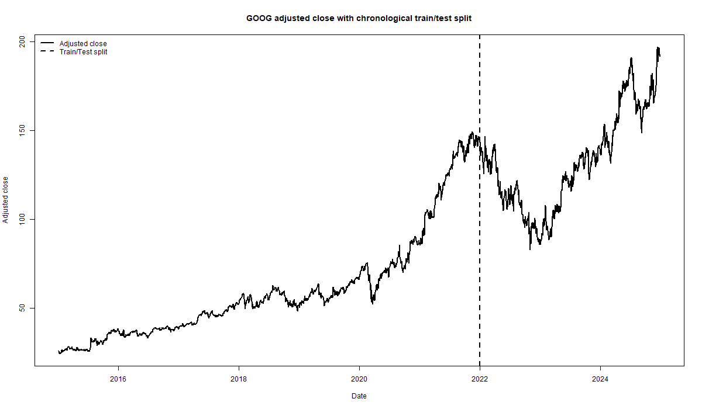
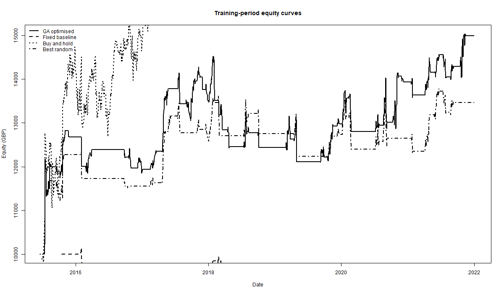
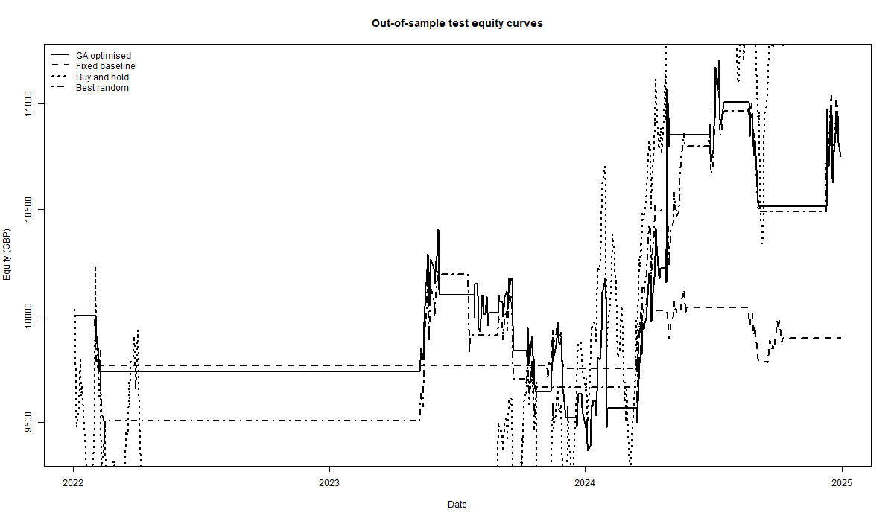
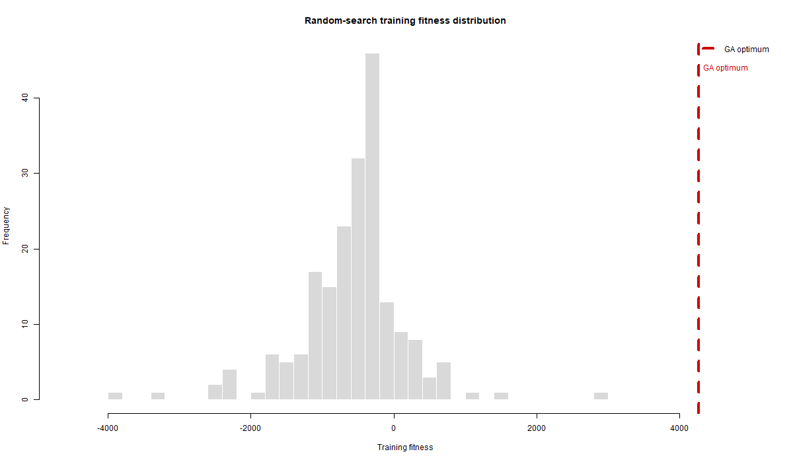

```{r setup, include=FALSE}
knitr::opts_chunk$set(
  echo = FALSE,
  message = FALSE,
  warning = FALSE,
  fig.align = "center",
  out.width = "95%",
  fig.pos = "H"
)
Sys.setenv(LANGUAGE = "en")
try(Sys.setlocale("LC_TIME", "C"), silent = TRUE)

if (!file.exists("results/ga_regime_strategy_results.rds")) {
  source("src/algorithmic_trading_strategy.R")
}

results <- readRDS("results/ga_regime_strategy_results.rds")

fmt_gbp <- function(x) paste0("GBP ", format(round(x, 2), nsmall = 2, big.mark = ","))
fmt_pct <- function(x) paste0(format(round(100 * x, 2), nsmall = 2), "%")
fmt_num <- function(x, digits = 2) format(round(x, digits), nsmall = digits, big.mark = ",")
fmt_signed_gbp <- function(x) paste0(ifelse(x >= 0, "+", "-"), fmt_gbp(abs(x)))

render_report_table <- function(df, caption, align = NULL, scale_down = FALSE, font_size = 8) {
  if (knitr::is_latex_output()) {
    tab <- knitr::kable(
      df,
      format = "latex",
      booktabs = TRUE,
      longtable = FALSE,
      align = align,
      caption = NULL
    )
    cat("\\begin{table}[H]\n\\centering\n")
    cat(sprintf("\\fontsize{%s}{%s}\\selectfont\n", font_size, font_size + 2))
    cat(sprintf("\\caption{%s}\n", caption))
    if (scale_down) cat("\\resizebox{\\linewidth}{!}{%\n")
    cat(tab, "\n")
    if (scale_down) cat("}\n")
    cat("\\end{table}\n")
  } else {
    print(knitr::kable(df, caption = caption, align = align))
  }
}

train_profit_gap <- results$best_eval$test$metrics$net_profit - results$best_eval$train$metrics$net_profit
profit_retention <- results$best_eval$test$metrics$net_profit / results$best_eval$train$metrics$net_profit
ga_vs_fixed_test_profit <- results$best_eval$test$metrics$net_profit - results$fixed_eval$test$metrics$net_profit
ga_vs_random_test_profit <- results$best_eval$test$metrics$net_profit - results$best_random_eval$test$metrics$net_profit
ga_vs_random_test_sharpe <- results$best_eval$test$metrics$sharpe - results$best_random_eval$test$metrics$sharpe
ga_vs_random_test_dd <- results$best_eval$test$metrics$max_dd_pct - results$best_random_eval$test$metrics$max_dd_pct
ga_vs_mean_random_test_profit <- results$best_eval$test$metrics$net_profit - results$random_summary$mean_test_profit
ga_vs_buyhold_test_profit <- results$best_eval$test$metrics$net_profit - results$buyhold_test$metrics$net_profit
ga_vs_buyhold_test_dd <- results$best_eval$test$metrics$max_dd_pct - results$buyhold_test$metrics$max_dd_pct
```


## Background to the problem

Algorithmic trading should be evaluated as a full decision system rather than as a pure forecasting exercise. A serious trading rule must combine data handling, signal generation, execution assumptions, transaction costs, position sizing and post-trade evaluation. That is why this project focuses on a complete trading architecture instead of a single technical indicator or a simple price forecast. The relevant methodological question is not whether the code is merely complicated, but whether the extra complexity is economically motivated and empirically justified.

The chosen design combines two well-known trading styles. Trend-following rules are often effective when price moves persistently in one direction, but they can suffer whipsaw losses in sideways markets. Mean-reversion rules can work well in quieter, range-bound periods, but they can fail badly if they keep fading a strong trend. A regime-switching architecture is therefore a sensible way to combine both ideas: ADX decides whether the market is trending strongly enough to justify MACD-based trend following, while RSI is used when the market appears weaker and more suitable for mean reversion. GOOG is a defensible case study for that design because it is liquid, widely followed and has experienced both sustained momentum phases and more hesitant consolidations over the sample.

The refined final version is deliberately **long/cash rather than long/short**. The diagnostic work on the first version showed that short trades were one of the main sources of out-of-sample weakness on a growth stock with a strong long-run upward bias. In the final strategy, bearish conditions flatten the portfolio instead of forcing short exposure. That is a meaningful design decision, not a cosmetic tweak, because it changes the economic interpretation of the system from a two-sided directional trader into a more conservative active timing rule. It is also easier to defend academically, because borrow costs and short-rebate mechanics are not modelled in the current backtest.

A genetic algorithm is used to optimise the parameter vector because the search space is mixed, nonlinear and path-dependent. Small changes to lookback windows, thresholds or stop distances can materially change trade timing, turnover and drawdown. In that setting, evolutionary search is more defensible than hand-tuning a large parameter set one variable at a time.

## Overview of data

The script downloads daily OHLCV data for **`r results$config$symbol`** from Yahoo Finance through `quantmod::getSymbols()` over **`r results$config$start_date`** to **`r results$config$end_date`**. The sample is split chronologically into a training period ending **`r as.character(results$config$train_end_date)`** and an out-of-sample test period starting **`r as.character(results$config$test_start_date)`**. This split is essential because a trading rule must be evaluated on data that were not used during optimisation.

An additional anti-look-ahead safeguard is built into the backtest. Signals are computed using information available at the close of day *t*, but trades are executed at the open of day *t + 1*. This is stricter and more realistic than trading at the same close used to generate the signal.

The daily frequency is appropriate for this project because it supports transparent backtesting, keeps runtime manageable for repeated optimisation, and still provides enough structure for MACD, RSI, ADX and ATR to be informative. The trade-off is that a daily strategy ignores intraday dynamics and gap risk within the bar, which should be acknowledged as a limitation.

The data choice also places a boundary on the strength of any conclusion. Because the evidence comes from a single large-cap US technology stock and a single train/test split, the report can support a careful claim about this strategy on this asset under this sample design, but not a blanket claim of market-wide robustness.

One methodological nuance matters for interpretation. The **test-period comparison is the cleanest comparison in the report**, because all strategies are evaluated on the same reserved calendar window from 2022 onward. The in-sample comparison is still useful, but it is slightly less decisive because different indicator lookbacks create different warm-up losses at the start of the training sample. That does not invalidate the analysis, but it means the out-of-sample section should carry more weight than the training section when final judgements are made.

The split date also creates a demanding test design. The training sample ends close to a local high in GOOG before a large 2022 drawdown, so the reserved test period begins in a much less favourable market regime than much of the training window. This is useful because it tests whether the long/cash timing rule can reduce exposure during a difficult regime, but it also means that the active strategy is partly being judged against a structural market break rather than a smooth continuation of the training distribution.

### Key code: data import and chronological split

```{r code-data-import, echo=TRUE, eval=FALSE}
symbol          <- "GOOG"
start_date      <- "2015-01-01"
end_date        <- "2024-12-31"
train_end_date  <- as.Date("2021-12-31")
test_start_date <- as.Date("2022-01-01")

price_xts <- suppressWarnings(
  getSymbols(Symbols = symbol,
             src = "yahoo",
             from = start_date,
             to   = end_date,
             auto.assign = FALSE)
)

price_xts <- na.omit(price_xts)
full_data <- build_indicator_data(price_xts, best_params)
train_data <- full_data[paste0("/", train_end_date)]
test_data  <- full_data[paste0(test_start_date, "/")]
```

```{r, results='asis'}
data_summary_view <- data.frame(
  Metric = c(
    "Symbol", "Start", "End", "Observations", "Training observations",
    "Test observations", "First adjusted close", "Last adjusted close",
    "Mean daily log return", "SD daily log return", "Annualised volatility",
    "Minimum daily log return", "Maximum daily log return", "Median volume"
  ),
  Value = c(
    results$data_summary$symbol,
    results$data_summary$start,
    results$data_summary$end,
    fmt_num(results$data_summary$observations, 0),
    fmt_num(results$data_summary$train_observations, 0),
    fmt_num(results$data_summary$test_observations, 0),
    fmt_num(results$data_summary$first_adjusted_close, 4),
    fmt_num(results$data_summary$last_adjusted_close, 4),
    fmt_num(results$data_summary$mean_daily_log_return, 4),
    fmt_num(results$data_summary$sd_daily_log_return, 4),
    fmt_num(results$data_summary$annualised_volatility, 4),
    fmt_num(results$data_summary$min_daily_log_return, 4),
    fmt_num(results$data_summary$max_daily_log_return, 4),
    fmt_num(results$data_summary$median_volume, 0)
  ),
  stringsAsFactors = FALSE
)

render_report_table(
  data_summary_view,
  caption = "Summary statistics for the downloaded GOOG daily data.",
  align = "ll",
  scale_down = FALSE,
  font_size = 8
)
```

```{r fig-price-split, echo=FALSE, fig.cap="Figure 1. GOOG adjusted close with the train/test split."}

```

## Trading strategy - sophistication and implementation quality

### Representation and parameter search

The GA chromosome optimises 15 variables:

1. MACD fast EMA window
2. MACD slow EMA window
3. MACD signal EMA window
4. RSI lookback window
5. ADX lookback window
6. ATR lookback window
7. SMA trend-filter window
8. ADX threshold separating trend and range regimes
9. RSI buy threshold
10. RSI sell threshold
11. RSI exit threshold
12. Initial stop distance in ATR multiples
13. Trailing-stop distance in ATR multiples
14. Maximum holding period
15. Fraction of equity risked per trade

This is materially more sophisticated than a textbook single-indicator strategy because it optimises not only signal thresholds, but also regime definition, trade management and risk allocation. The GA search itself is also intentionally conservative in this final version: the search budget is large enough to explore the space meaningfully, but not so aggressive that it obviously encourages a train-period champion at the expense of out-of-sample behaviour. That moderation is important because, in finance, the best-looking in-sample solution is often not the most believable one.

The optimisation design is deliberately centred on a genetic algorithm. Random search is included as a benchmark for unguided exploration, but other population-based or sequential optimisers such as particle swarm optimisation, differential evolution or Bayesian optimisation are not evaluated here. This limits the strength of any claim about GA superiority; the project can assess whether this GA implementation is useful for the chosen trading architecture, not whether GA is the best possible optimiser for the problem.

### Key code: parameter repair and indicator construction

```{r code-params-indicators, echo=TRUE, eval=FALSE}
repair_params <- function(x) {
  p <- list(
    macd_fast   = as.integer(round(x[1])),
    macd_slow   = as.integer(round(x[2])),
    macd_signal = as.integer(round(x[3])),
    rsi_n       = as.integer(round(x[4])),
    adx_n       = as.integer(round(x[5])),
    atr_n       = as.integer(round(x[6])),
    sma_n       = as.integer(round(x[7])),
    adx_regime  = as.numeric(x[8]),
    rsi_buy     = as.numeric(x[9]),
    rsi_sell    = as.numeric(x[10]),
    rsi_exit    = as.numeric(x[11]),
    stop_atr    = as.numeric(x[12]),
    trail_atr   = as.numeric(x[13]),
    max_hold    = as.integer(round(x[14])),
    risk_frac   = as.numeric(x[15])
  )

  p$macd_slow <- min(max(p$macd_slow, p$macd_fast + 2), 60)
  p$rsi_sell  <- min(max(p$rsi_sell, p$rsi_buy + 10), 90)
  p$rsi_exit  <- min(max(p$rsi_exit, p$rsi_buy + 5), p$rsi_sell - 5)
  p
}

build_indicator_data <- function(px, p) {
  macd_obj <- MACD(Cl(px), nFast = p$macd_fast, nSlow = p$macd_slow,
                   nSig = p$macd_signal, maType = "EMA")
  indicators <- merge(
    macd_obj[, "macd"],
    macd_obj[, "signal"],
    macd_obj[, "macd"] - macd_obj[, "signal"],
    RSI(Cl(px), n = p$rsi_n),
    ADX(HLC(px), n = p$adx_n)[, "ADX"],
    ATR(HLC(px), n = p$atr_n)[, "atr"],
    SMA(Cl(px), n = p$sma_n)
  )
  colnames(indicators) <- c("macd", "signal", "hist", "rsi", "adx", "atr", "sma")
  na.omit(merge(px, indicators))
}
```

```{r, results='asis'}
param_table <- data.frame(
  Parameter = names(results$best_params),
  Value = fmt_num(as.numeric(unlist(results$best_params)), 4),
  stringsAsFactors = FALSE
)

render_report_table(
  param_table,
  caption = "Best parameter vector found by the GA on the training set.",
  align = "ll",
  scale_down = FALSE,
  font_size = 8
)
```

### Trading logic

In a trending regime (`ADX >= threshold`), the system enters long when the MACD histogram crosses from non-positive to positive and price is above the SMA filter. Bearish trend signals do not open a short; instead, the strategy stays flat once the current long is exited.

In a ranging regime (`ADX < threshold`), the system uses RSI mean reversion. Long entries wait for RSI to move out of oversold territory rather than buying immediately at the first extreme. Again, the strategy does not short in this state; unfavourable conditions simply leave the portfolio in cash. This confirmation step makes the implementation more defensible than a naive threshold trigger.

### Key code: regime logic and next-open execution

```{r code-backtest-logic, echo=TRUE, eval=FALSE}
trend_regime <- adx[i] >= p$adx_regime

trend_long_entry  <- trend_regime  &&
  hist[i - 1] <= 0 && hist[i] > 0 && current_close > sma[i]
trend_short_entry <- FALSE

range_long_entry  <- !trend_regime &&
  rsi[i - 1] < p$rsi_buy && rsi[i] >= p$rsi_buy
range_short_entry <- FALSE

if (position == 1L && entry_style == "trend_long" && hist[i] < 0) {
  exit_flag <- TRUE
  exit_reason <- "MACD trend reversal"
}

if (position == 1L && entry_style == "range_long" && rsi[i] >= p$rsi_exit) {
  exit_flag <- TRUE
  exit_reason <- "RSI mean-reversion exit"
}

if (position == 0L && desired_signal == 1L) {
  stop_distance <- max(atr[i] * p$stop_atr, next_open * 0.005)
  risk_budget   <- cash * p$risk_frac
  raw_shares    <- floor(risk_budget / stop_distance)
  max_shares    <- floor((cash * max_capital_frac) / next_open)
  shares_to_trade <- max(0L, min(raw_shares, max_shares))
}
```

### Execution and risk management

Execution is fully automated and explicit:

- signals are generated at the close of day *t*
- entries and exits are executed at the next open
- only one net long position can be open at a time; otherwise the portfolio is flat
- position size is scaled using ATR and capped by a maximum fraction of equity
- commission and slippage are charged on every fill

Risk management is built into the rule at three levels. Initial stop distance is ATR-based, trailing stops adapt as the trade evolves, and a maximum holding period prevents stale positions from remaining open indefinitely. This is important because a complete trading-system study should implement a complete trading system rather than a bare signal. In the final version, risk control also includes a structural choice to avoid shorting an asset whose long-run drift is strongly positive.

The comparison is also methodologically fair in one important sense: the same commission and slippage assumptions are imposed on the GA strategy, the fixed baseline, the random parameter benchmarks and buy-and-hold. This matters because a trading rule that only wins when friction is ignored would not deserve a high evaluation.

### Fitness function

The GA optimises a drawdown-aware profit objective on the training set:

$$
\text{fitness} = \text{net profit} - 0.30 \times \text{max drawdown in GBP} - \text{inactivity penalty}
$$

This choice is sensible because pure return maximisation can easily reward unstable or trivially inactive solutions. Profit remains the dominant term, but the penalty structure discourages very deep drawdowns and parameter sets that hardly trade.

### Key code: fitness function and GA search

```{r code-fitness-ga, echo=TRUE, eval=FALSE}
compute_equity_metrics <- function(equity_curve, trade_log, initial_capital, final_equity) {
  eq <- as.numeric(equity_curve)
  peak <- cummax(eq)
  max_dd_gbp <- max(peak - eq, na.rm = TRUE)
  net_profit <- final_equity - initial_capital
  n_trades <- sum(trade_log$event %in% c("LONG_EXIT", "FINAL_LONG_EXIT"))
  inactivity_penalty <- if (n_trades < 5) 250 else 0
  fitness <- net_profit - 0.30 * max_dd_gbp - inactivity_penalty
  fitness
}

ga_result <- ga(
  type = "real-valued",
  fitness = fitness_function,
  lower = ga_lower,
  upper = ga_upper,
  popSize = 40,
  maxiter = 20,
  run = 8,
  elitism = 4,
  pcrossover = 0.8,
  pmutation = 0.15,
  keepBest = TRUE,
  seed = 123
)
```

## Presentation of performance on training data

```{r, results='asis'}
train_metrics_view <- data.frame(
  Metric = c(
    "Final equity", "Net profit", "Total return", "Annual return",
    "Sharpe ratio", "Max drawdown (GBP)", "Max drawdown (%)",
    "Closed trades", "Win rate", "Fitness"
  ),
  Value = c(
    fmt_gbp(results$best_eval$train$metrics$final_equity),
    fmt_gbp(results$best_eval$train$metrics$net_profit),
    fmt_pct(results$best_eval$train$metrics$total_return),
    fmt_pct(results$best_eval$train$metrics$annual_return),
    fmt_num(results$best_eval$train$metrics$sharpe),
    fmt_gbp(results$best_eval$train$metrics$max_dd_gbp),
    fmt_pct(results$best_eval$train$metrics$max_dd_pct),
    fmt_num(results$best_eval$train$metrics$trades, 0),
    fmt_pct(results$best_eval$train$metrics$win_rate),
    fmt_gbp(results$best_eval$train$metrics$fitness)
  )
)

render_report_table(
  train_metrics_view,
  caption = "Training-period performance of the GA-optimised strategy.",
  align = "ll",
  scale_down = FALSE,
  font_size = 8
)
```

```{r fig-train-equity, echo=FALSE, fig.cap="Figure 2. Training-period equity curves for the GA strategy and benchmarks."}

```

On the training set the GA grows capital from **GBP 10,000** to **`r fmt_gbp(results$best_eval$train$metrics$final_equity)`**, generating **`r fmt_gbp(results$best_eval$train$metrics$net_profit)`** with a Sharpe ratio of **`r fmt_num(results$best_eval$train$metrics$sharpe)`** and a maximum drawdown of **`r fmt_pct(results$best_eval$train$metrics$max_dd_pct)`**. That is a credible in-sample result rather than a trivial or inactive one, because the strategy closes **`r fmt_num(results$best_eval$train$metrics$trades, 0)`** trades.

The training result is good, but it is not automatically decisive. Buy and hold earns much more raw profit in-sample because GOOG experiences a strong long-run upward drift over this period. The more defensible claim for the GA in training is therefore not that it produces the highest raw return, but that it generates positive active performance with much lower drawdown than passive exposure. In other words, the training section shows that the architecture is viable, but not yet that it is superior in the economically strongest sense.

## Presentation and analysis of performance on test data

```{r, results='asis'}
test_metrics_view <- data.frame(
  Metric = c(
    "Final equity", "Net profit", "Total return", "Annual return",
    "Sharpe ratio", "Max drawdown (GBP)", "Max drawdown (%)",
    "Closed trades", "Win rate", "Fitness"
  ),
  Value = c(
    fmt_gbp(results$best_eval$test$metrics$final_equity),
    fmt_gbp(results$best_eval$test$metrics$net_profit),
    fmt_pct(results$best_eval$test$metrics$total_return),
    fmt_pct(results$best_eval$test$metrics$annual_return),
    fmt_num(results$best_eval$test$metrics$sharpe),
    fmt_gbp(results$best_eval$test$metrics$max_dd_gbp),
    fmt_pct(results$best_eval$test$metrics$max_dd_pct),
    fmt_num(results$best_eval$test$metrics$trades, 0),
    fmt_pct(results$best_eval$test$metrics$win_rate),
    fmt_gbp(results$best_eval$test$metrics$fitness)
  )
)

render_report_table(
  test_metrics_view,
  caption = "Out-of-sample test performance of the GA-optimised strategy.",
  align = "ll",
  scale_down = FALSE,
  font_size = 8
)
```

```{r fig-test-equity, echo=FALSE, fig.cap="Figure 3. Out-of-sample equity curves for the GA strategy and benchmarks."}

```

Out of sample, the GA remains profitable, finishing at **`r fmt_gbp(results$best_eval$test$metrics$final_equity)`** with net profit of **`r fmt_gbp(results$best_eval$test$metrics$net_profit)`**. That is important because the strategy does not collapse on unseen data. The revised long/cash version improves the test result relative to the earlier long/short design, especially in absolute profit and risk-adjusted return. However, the test result is still clearly weaker than the training result. Net profit changes by **`r fmt_signed_gbp(train_profit_gap)`**, which means only about **`r fmt_pct(profit_retention)`** of the training profit is retained on the test set. The test Sharpe ratio of **`r fmt_num(results$best_eval$test$metrics$sharpe)`** should therefore be described as improved but still moderate rather than strong.

This pattern suggests some degree of overfitting, though not a complete failure. A fully overfit strategy would often turn sharply negative once optimisation stops. Here the GA still earns money after costs, but the deterioration is large enough that the out-of-sample evidence should be interpreted cautiously. Precisely because the test window is the most like-for-like comparison in the report, this is the section that should dominate the final judgement.

## Comparison against other approaches

Three benchmarks are used:

1. Buy and hold
2. A fixed baseline with hand-chosen textbook parameters
3. Randomly sampled parameter vectors from the same search space

### Training-set comparison

```{r, results='asis'}
train_comp <- results$train_comparison
train_comp_view <- data.frame(
  Strategy = train_comp$strategy,
  `Net profit` = ifelse(is.na(train_comp$net_profit), NA, sapply(train_comp$net_profit, fmt_gbp)),
  `Total return` = ifelse(is.na(train_comp$total_return), NA, sapply(train_comp$total_return, fmt_pct)),
  `Ann. return` = ifelse(is.na(train_comp$annual_return), NA, sapply(train_comp$annual_return, fmt_pct)),
  Sharpe = ifelse(is.na(train_comp$sharpe), NA, sapply(train_comp$sharpe, fmt_num)),
  `Max DD %` = ifelse(is.na(train_comp$max_dd_pct), NA, sapply(train_comp$max_dd_pct, fmt_pct)),
  Trades = ifelse(is.na(train_comp$trades), NA, sapply(train_comp$trades, fmt_num, digits = 0)),
  `Win rate` = ifelse(is.na(train_comp$win_rate), NA, sapply(train_comp$win_rate, fmt_pct)),
  Fitness = ifelse(is.na(train_comp$fitness), NA, sapply(train_comp$fitness, fmt_gbp)),
  stringsAsFactors = FALSE
)

render_report_table(
  train_comp_view,
  caption = "Training-set comparison across the optimised strategy and baselines.",
  align = "lllllllll",
  scale_down = TRUE,
  font_size = 8
)
```

### Test-set comparison

```{r, results='asis'}
test_comp <- results$test_comparison
test_comp_view <- data.frame(
  Strategy = test_comp$strategy,
  `Net profit` = ifelse(is.na(test_comp$net_profit), NA, sapply(test_comp$net_profit, fmt_gbp)),
  `Total return` = ifelse(is.na(test_comp$total_return), NA, sapply(test_comp$total_return, fmt_pct)),
  `Ann. return` = ifelse(is.na(test_comp$annual_return), NA, sapply(test_comp$annual_return, fmt_pct)),
  Sharpe = ifelse(is.na(test_comp$sharpe), NA, sapply(test_comp$sharpe, fmt_num)),
  `Max DD %` = ifelse(is.na(test_comp$max_dd_pct), NA, sapply(test_comp$max_dd_pct, fmt_pct)),
  Trades = ifelse(is.na(test_comp$trades), NA, sapply(test_comp$trades, fmt_num, digits = 0)),
  `Win rate` = ifelse(is.na(test_comp$win_rate), NA, sapply(test_comp$win_rate, fmt_pct)),
  stringsAsFactors = FALSE
)

render_report_table(
  test_comp_view,
  caption = "Out-of-sample comparison across the optimised strategy and baselines.",
  align = "llllllll",
  scale_down = TRUE,
  font_size = 8
)
```

```{r fig-random-fitness, echo=FALSE, fig.cap="Figure 4. Distribution of training fitness under random parameter search. The dashed line marks the GA optimum."}

```

The benchmark evidence is mixed but informative. On the test set, the GA beats the fixed baseline by **`r fmt_gbp(ga_vs_fixed_test_profit)`** of net profit. It also beats the **average** random solution by about **`r fmt_gbp(ga_vs_mean_random_test_profit)`**, which is important because it shows that guided search materially improves expected performance relative to unguided sampling. However, the **best** random draw remains extremely competitive and in this run is marginally ahead of the GA on test-period profit by **`r fmt_gbp(abs(ga_vs_random_test_profit))`**. The GA is also weaker than that best random draw on Sharpe by about **`r fmt_num(abs(ga_vs_random_test_sharpe))`** and has a higher drawdown by roughly **`r fmt_pct(abs(ga_vs_random_test_dd))`**. The honest interpretation is therefore that the evolutionary search is useful, but not overwhelmingly dominant over every unguided alternative.

The GA also does **not** beat buy and hold on test-period profit. The active strategy underperforms passive exposure by **`r fmt_gbp(abs(ga_vs_buyhold_test_profit))`**. Its compensating strength is drawdown control: the GA's maximum drawdown is **`r fmt_pct(results$best_eval$test$metrics$max_dd_pct)`**, versus **`r fmt_pct(results$buyhold_test$metrics$max_dd_pct)`** for buy and hold, a reduction of about **`r fmt_pct(abs(ga_vs_buyhold_test_dd))`**. This is the fairest interpretation of the result: the strategy is better defended as a lower-drawdown active rule than as the outright best-return strategy.

This drawdown result is especially relevant because the test window begins after a local peak and includes the subsequent 2022 weakness in GOOG. The active strategy's lower drawdown therefore has a clear economic interpretation: it gives up part of the upside captured by passive exposure, but it also avoids a large part of the test-period equity decline.

That distinction matters for research interpretation. A strong comparison section should not simply celebrate the optimised model; it should explain exactly where the optimisation helped, where it did not, and what claim remains economically defensible after all the benchmarks are considered.

### Key code: random-search benchmark and comparison table

```{r code-benchmarks, echo=TRUE, eval=FALSE}
random_solution_generator <- function() {
  raw <- c(
    runif(1, ga_lower[1],  ga_upper[1]),
    runif(1, ga_lower[2],  ga_upper[2]),
    runif(1, ga_lower[3],  ga_upper[3]),
    runif(1, ga_lower[4],  ga_upper[4]),
    runif(1, ga_lower[5],  ga_upper[5]),
    runif(1, ga_lower[6],  ga_upper[6]),
    runif(1, ga_lower[7],  ga_upper[7]),
    runif(1, ga_lower[8],  ga_upper[8]),
    runif(1, ga_lower[9],  ga_upper[9]),
    runif(1, ga_lower[10], ga_upper[10]),
    runif(1, ga_lower[11], ga_upper[11]),
    runif(1, ga_lower[12], ga_upper[12]),
    runif(1, ga_lower[13], ga_upper[13]),
    runif(1, ga_lower[14], ga_upper[14]),
    runif(1, ga_lower[15], ga_upper[15])
  )
  repair_params(raw)
}

test_comparison <- rbind(
  with_name("GA_Optimised",         best_eval$test$metrics),
  with_name("Fixed_Baseline",       fixed_eval$test$metrics),
  with_name("Best_Random_Solution", best_random_eval$test$metrics),
  with_name("Buy_and_Hold",         buyhold_test$metrics)
)
```

## Conclusion

The final system is a complete algorithmic trading strategy rather than a single-indicator toy example. It includes data download, indicator construction, regime identification, long/cash trading logic, transaction costs, volatility-aware position sizing, stop management, GA-based optimisation, out-of-sample testing and comparison against sensible benchmarks. That should score well for strategy sophistication and implementation quality.

The evidence is not perfect, though. The revised long/cash GA improves the out-of-sample result and clearly outperforms the fixed baseline, which supports the usefulness of the refinement. At the same time, buy and hold still dominates on raw test-period return, and the best random draw remains a very strong benchmark. The most credible final claim is therefore that the project delivers a solid, well-implemented research prototype with good risk-control ideas and visibly improved out-of-sample behaviour, rather than a dominant trading rule that clearly beats passive exposure in all respects.

That is the kind of claim a disciplined empirical finance report should make: ambitious enough to show what the system achieves, but disciplined enough not to overstate what a single-asset, single-split experiment can prove.

If this were extended beyond the current prototype, the next methodological upgrades should be a common-start alignment for every in-sample benchmark, rolling-window or walk-forward validation, alternative optimisers such as particle swarm optimisation or differential evolution, and a richer cost model including borrow frictions for any future short-capable version. Stating those next steps explicitly is part of a strong critical evaluation because it shows where the current evidence genuinely ends.

## References

Treleaven, P., Galas, M. and Lalchand, V. (2013). *Algorithmic Trading Review*. Communications of the ACM, 56(11), 76-85.

Course materials on financial forecasting and evolutionary computation for finance.

Week 7 laboratory file. *profitcalc.R*. University course material.

<!-- The full strategy implementation is embedded below for auditability while the rendered report stays concise. -->
```{r full_strategy_hidden, include=FALSE, eval=FALSE}

# Evolutionary computation for finance
# Standalone implementation

# Title: Evolutionary optimisation of a regime-switching technical
#        trading strategy for GOOG using quantmod + TTR
#
# Strategy summary

# 1) Download daily GOOG data from Yahoo Finance with quantmod.
# 2) Build a regime-switching strategy using:
#       - MACD for trend-following entries/exits,
#       - RSI for mean-reversion entries/exits,
#       - ADX to decide whether the market is trending or ranging,
#       - ATR for stop distance and volatility-aware position sizing,
#       - SMA as an additional trend filter.
# 3) Use a Genetic Algorithm (GA package) to optimise the indicator
#    windows and trading-rule thresholds on the training set only.
# 4) Evaluate the best strategy on a reserved out-of-sample test set.
# 5) Compare the optimised strategy with:
#       - a fixed, hand-chosen baseline strategy,
#       - buy-and-hold,
#       - random parameter solutions.
#
# Notes
# -----
# * Signals are generated using information available at close on day t.
# * Orders are executed at the OPEN on day t+1 to avoid look-ahead bias.
# * Initial notional capital is fixed at GBP 10,000 for every experiment.
# * A flat commission and slippage assumption is included.


# 0. Package setup

required_packages <- c("quantmod", "TTR", "GA")
missing_packages <- required_packages[!sapply(required_packages, requireNamespace, quietly = TRUE)]

if (length(missing_packages) > 0) {
  cran_repo <- "https://cloud.r-project.org"
  install.packages(missing_packages, repos = cran_repo)
}

still_missing <- required_packages[!sapply(required_packages, requireNamespace, quietly = TRUE)]
if (length(still_missing) > 0) {
  stop(
    "The following packages are still missing after installation was attempted: ",
    paste(still_missing, collapse = ", "),
    "."
  )
}

library(quantmod)
library(TTR)
library(GA)

set.seed(123)
options(stringsAsFactors = FALSE)

# Create output folders so that the script can save tables, figures and an
# RDS object containing all final results for later reuse in a report.
dir.create("figures", showWarnings = FALSE)
dir.create("results", showWarnings = FALSE)


# 1. Global configuration

symbol            <- "GOOG"
start_date        <- "2015-01-01"
end_date          <- "2024-12-31"
train_end_date    <- as.Date("2021-12-31")
test_start_date   <- as.Date("2022-01-01")
initial_capital   <- 10000
commission_gbp    <- 5         # flat commission paid on every entry and exit
slippage_bps      <- 5         # 5 basis points on every fill
max_capital_frac  <- 0.95      # never allocate more than 95% of equity
random_baseline_n <- 200       # number of random solutions used for comparison
allow_short_positions <- FALSE # bearish signals flatten the book instead of opening shorts

# Helper formatting functions that are also convenient inside an R Markdown
# report if this script is sourced there.
fmt_gbp <- function(x) paste0("GBP ", format(round(x, 2), nsmall = 2, big.mark = ","))
fmt_pct <- function(x) paste0(format(round(100 * x, 2), nsmall = 2), "%")
fmt_num <- function(x, digits = 2) format(round(x, digits), nsmall = digits, big.mark = ",")


# 2. Download data

# quantmod returns an xts object with Open, High, Low, Close, Volume and
# Adjusted columns.
price_xts <- suppressWarnings(
  getSymbols(Symbols = symbol,
             src = "yahoo",
             from = start_date,
             to   = end_date,
             auto.assign = FALSE)
)

price_xts <- na.omit(price_xts)

# 3. Data summary function

make_data_summary <- function(px, train_end) {
  adj <- Ad(px)
  ret <- na.omit(dailyReturn(adj, type = "log"))

  data.frame(
    symbol                 = symbol,
    start                  = as.character(start(px)),
    end                    = as.character(end(px)),
    observations           = nrow(px),
    train_observations     = sum(index(px) <= train_end),
    test_observations      = sum(index(px) > train_end),
    first_adjusted_close   = as.numeric(first(adj)),
    last_adjusted_close    = as.numeric(last(adj)),
    mean_daily_log_return  = mean(as.numeric(ret), na.rm = TRUE),
    sd_daily_log_return    = sd(as.numeric(ret), na.rm = TRUE),
    annualised_volatility  = sd(as.numeric(ret), na.rm = TRUE) * sqrt(252),
    min_daily_log_return   = min(as.numeric(ret), na.rm = TRUE),
    max_daily_log_return   = max(as.numeric(ret), na.rm = TRUE),
    median_volume          = median(as.numeric(Vo(px)), na.rm = TRUE)
  )
}

data_summary <- make_data_summary(price_xts, train_end_date)
write.csv(data_summary, "results/data_summary.csv", row.names = FALSE)


# 4. Parameter repair / decode

# The GA package works with real-valued chromosomes. This helper converts the
# raw chromosome into a valid parameter list and repairs any ordering issues.
repair_params <- function(x) {
  p <- list(
    macd_fast   = as.integer(round(x[1])),
    macd_slow   = as.integer(round(x[2])),
    macd_signal = as.integer(round(x[3])),
    rsi_n       = as.integer(round(x[4])),
    adx_n       = as.integer(round(x[5])),
    atr_n       = as.integer(round(x[6])),
    sma_n       = as.integer(round(x[7])),
    adx_regime  = as.numeric(x[8]),
    rsi_buy     = as.numeric(x[9]),
    rsi_sell    = as.numeric(x[10]),
    rsi_exit    = as.numeric(x[11]),
    stop_atr    = as.numeric(x[12]),
    trail_atr   = as.numeric(x[13]),
    max_hold    = as.integer(round(x[14])),
    risk_frac   = as.numeric(x[15])
  )

  # Hard bounds
  p$macd_fast   <- min(max(p$macd_fast, 4), 20)
  p$macd_slow   <- min(max(p$macd_slow, p$macd_fast + 2), 60)
  p$macd_signal <- min(max(p$macd_signal, 3), 15)
  p$rsi_n       <- min(max(p$rsi_n, 5), 30)
  p$adx_n       <- min(max(p$adx_n, 5), 30)
  p$atr_n       <- min(max(p$atr_n, 5), 30)
  p$sma_n       <- min(max(p$sma_n, 50), 250)
  p$adx_regime  <- min(max(p$adx_regime, 10), 35)
  p$rsi_buy     <- min(max(p$rsi_buy, 10), 45)
  p$rsi_sell    <- min(max(p$rsi_sell, p$rsi_buy + 10), 90)
  p$rsi_exit    <- min(max(p$rsi_exit, p$rsi_buy + 5), p$rsi_sell - 5)
  p$stop_atr    <- min(max(p$stop_atr, 1.0), 5.0)
  p$trail_atr   <- min(max(p$trail_atr, 1.0), 7.0)
  p$max_hold    <- min(max(p$max_hold, 3), 40)
  p$risk_frac   <- min(max(p$risk_frac, 0.005), 0.03)

  p
}

# Lower and upper bounds used directly by GA::ga(). The repair function above
# still acts as a final safety net.
ga_lower <- c(4,  21, 3,  5,  5,  5,  50, 10, 10, 55, 45, 1.0, 1.0, 3, 0.005)
ga_upper <- c(20, 60, 15, 30, 30, 30, 250, 35, 45, 90, 60, 5.0, 7.0, 40, 0.030)

# A sensible non-evolved baseline using standard technical-analysis settings.
fixed_baseline_params <- list(
  macd_fast   = 12,
  macd_slow   = 26,
  macd_signal = 9,
  rsi_n       = 14,
  adx_n       = 14,
  atr_n       = 14,
  sma_n       = 200,
  adx_regime  = 20,
  rsi_buy     = 30,
  rsi_sell    = 70,
  rsi_exit    = 50,
  stop_atr    = 2.0,
  trail_atr   = 3.0,
  max_hold    = 15,
  risk_frac   = 0.02
)


# 5. Build indicator data

# This function computes all indicator series needed by the strategy.
build_indicator_data <- function(px, p) {
  macd_obj <- MACD(Cl(px),
                   nFast = p$macd_fast,
                   nSlow = p$macd_slow,
                   nSig  = p$macd_signal,
                   maType = "EMA")

  rsi_vec <- RSI(Cl(px), n = p$rsi_n)
  adx_obj <- ADX(HLC(px), n = p$adx_n)
  atr_obj <- ATR(HLC(px), n = p$atr_n)
  sma_vec <- SMA(Cl(px), n = p$sma_n)

  indicators <- merge(
    macd_obj[, "macd"],
    macd_obj[, "signal"],
    macd_obj[, "macd"] - macd_obj[, "signal"],
    rsi_vec,
    adx_obj[, "ADX"],
    atr_obj[, "atr"],
    sma_vec
  )
  colnames(indicators) <- c("macd", "signal", "hist", "rsi", "adx", "atr", "sma")

  out <- merge(px, indicators)

  # Remove the initial warm-up rows where long indicator windows are not yet
  # available.
  out <- na.omit(out)
  out
}

# 6. Utility: equity metrics

compute_equity_metrics <- function(equity_curve,
                                   trade_log,
                                   initial_capital,
                                   final_equity) {
  eq <- as.numeric(equity_curve)
  eq <- eq[is.finite(eq)]

  # Daily equity returns.
  if (length(eq) > 1) {
    ret <- diff(eq) / head(eq, -1)
    ret <- ret[is.finite(ret)]
  } else {
    ret <- numeric(0)
  }

  total_return <- final_equity / initial_capital - 1
  ann_return <- if (length(eq) > 1) {
    (final_equity / initial_capital)^(252 / (length(eq) - 1)) - 1
  } else {
    NA_real_
  }

  sharpe <- if (length(ret) > 1 && sd(ret, na.rm = TRUE) > 0) {
    sqrt(252) * mean(ret, na.rm = TRUE) / sd(ret, na.rm = TRUE)
  } else {
    0
  }

  peak <- cummax(eq)
  dd_gbp <- peak - eq
  dd_pct <- eq / peak - 1

  max_dd_gbp <- max(dd_gbp, na.rm = TRUE)
  max_dd_pct <- abs(min(dd_pct, na.rm = TRUE))

  closed_trade_mask <- trade_log$event %in% c("LONG_EXIT", "SHORT_EXIT", "FINAL_LONG_EXIT", "FINAL_SHORT_EXIT")
  closed_trades <- trade_log[closed_trade_mask, , drop = FALSE]
  n_trades <- nrow(closed_trades)

  win_rate <- if (n_trades > 0) {
    mean(closed_trades$trade_pnl > 0, na.rm = TRUE)
  } else {
    0
  }

  net_profit <- final_equity - initial_capital

  # Profit-based fitness with a drawdown penalty and a penalty for trivially
  # inactive strategies. Profit remains the dominant term.
  inactivity_penalty <- if (n_trades < 5) 250 else 0
  fitness <- net_profit - 0.30 * max_dd_gbp - inactivity_penalty

  data.frame(
    final_equity   = final_equity,
    net_profit     = net_profit,
    total_return   = total_return,
    annual_return  = ann_return,
    sharpe         = sharpe,
    max_dd_gbp     = max_dd_gbp,
    max_dd_pct     = max_dd_pct,
    trades         = n_trades,
    win_rate       = win_rate,
    fitness        = fitness
  )
}


# 7. Core backtest

# This is the most important function in the script. It implements all trading
# logic using only information available at time t and executes orders at the
# next open (t + 1).
backtest_strategy <- function(data,
                              p,
                              initial_capital = 10000,
                              commission = 5,
                              slippage_bps = 5,
                              max_capital_frac = 0.95) {

  n <- nrow(data)
  if (n < 30) {
    empty_equity <- xts(rep(initial_capital, n), order.by = index(data))
    empty_log <- data.frame()
    metrics <- data.frame(
      final_equity = initial_capital,
      net_profit   = 0,
      total_return = 0,
      annual_return = 0,
      sharpe = 0,
      max_dd_gbp = 0,
      max_dd_pct = 0,
      trades = 0,
      win_rate = 0,
      fitness = -1e9
    )
    return(list(equity = empty_equity, trade_log = empty_log, metrics = metrics))
  }

  opn  <- as.numeric(Op(data))
  cls  <- as.numeric(Cl(data))
  hist <- as.numeric(data$hist)
  rsi  <- as.numeric(data$rsi)
  adx  <- as.numeric(data$adx)
  atr  <- as.numeric(data$atr)
  sma  <- as.numeric(data$sma)
  dts  <- index(data)

  # Slippage converter.
  slip <- slippage_bps / 10000

  # State variables for the current portfolio.
  cash          <- initial_capital
  position      <- 0L     # 1 = long, -1 = short, 0 = flat
  shares        <- 0L
  entry_price   <- NA_real_
  entry_atr     <- NA_real_
  entry_date    <- as.Date(NA)
  entry_style   <- NA_character_
  bars_held     <- 0L
  highest_close <- NA_real_
  lowest_close  <- NA_real_

  # A simple list that will later be converted to a data.frame trade log.
  trade_log_list <- list()
  trade_row <- 0L

  # Daily equity curve valued at the close of each bar.
  equity <- rep(initial_capital, n)

  # Helper used repeatedly to add a row to the trade log.
  append_trade <- function(date, event, direction, shares, price, reason, trade_pnl, cash_after) {
    trade_row <<- trade_row + 1L
    trade_log_list[[trade_row]] <<- data.frame(
      date       = as.character(date),
      event      = event,
      direction  = direction,
      shares     = shares,
      price      = price,
      reason     = reason,
      trade_pnl  = trade_pnl,
      cash_after = cash_after,
      stringsAsFactors = FALSE
    )
  }

  # Start at row 2 because some signals use the previous day's indicator value.
  # End at n - 1 because all orders are executed at the next day's open.
  for (i in 2:(n - 1)) {

    current_close  <- cls[i]
    next_open      <- opn[i + 1]
    current_equity <- cash + position * shares * current_close

    # If a position is already open, update holding duration and trailing state
    # using today's close.
    current_stop <- NA_real_
    if (position != 0L) {
      bars_held <- bars_held + 1L

      if (position == 1L) {
        highest_close <- if (is.na(highest_close)) current_close else max(highest_close, current_close)
        current_stop  <- max(entry_price - p$stop_atr * entry_atr,
                             highest_close - p$trail_atr * atr[i])
      }

      if (position == -1L) {
        lowest_close <- if (is.na(lowest_close)) current_close else min(lowest_close, current_close)
        current_stop <- min(entry_price + p$stop_atr * entry_atr,
                            lowest_close + p$trail_atr * atr[i])
      }
    }

    # Record close-to-close equity BEFORE any action scheduled for tomorrow's open.
    equity[i] <- current_equity


    # Entries

    trend_regime <- adx[i] >= p$adx_regime

    trend_long_entry  <- trend_regime  && hist[i - 1] <= 0 && hist[i] > 0 && current_close > sma[i]
    trend_short_entry <- allow_short_positions &&
      trend_regime && hist[i - 1] >= 0 && hist[i] < 0 && current_close < sma[i]

    # In the ranging regime we wait for RSI to move back out of an extreme,
    # which avoids buying a falling knife immediately after oversold is first hit.
    range_long_entry  <- !trend_regime && rsi[i - 1] < p$rsi_buy  && rsi[i] >= p$rsi_buy
    range_short_entry <- allow_short_positions &&
      !trend_regime && rsi[i - 1] > p$rsi_sell && rsi[i] <= p$rsi_sell

    desired_signal <- 0L
    desired_style  <- NA_character_

    if (trend_long_entry)  { desired_signal <-  1L; desired_style <- "trend_long"  }
    if (trend_short_entry) { desired_signal <- -1L; desired_style <- "trend_short" }
    if (range_long_entry)  { desired_signal <-  1L; desired_style <- "range_long"  }
    if (range_short_entry) { desired_signal <- -1L; desired_style <- "range_short" }


    # Exits

    exit_flag   <- FALSE
    exit_reason <- NA_character_

    if (position == 1L) {
      if (entry_style == "trend_long" && hist[i] < 0) {
        exit_flag <- TRUE
        exit_reason <- "MACD trend reversal"
      }
      if (entry_style == "range_long" && rsi[i] >= p$rsi_exit) {
        exit_flag <- TRUE
        exit_reason <- "RSI mean-reversion exit"
      }
      if (!is.na(current_stop) && current_close <= current_stop) {
        exit_flag <- TRUE
        exit_reason <- "ATR trailing stop"
      }
      if (bars_held >= p$max_hold) {
        exit_flag <- TRUE
        exit_reason <- "Maximum holding period"
      }
    }

    if (position == -1L) {
      if (entry_style == "trend_short" && hist[i] > 0) {
        exit_flag <- TRUE
        exit_reason <- "MACD trend reversal"
      }
      if (entry_style == "range_short" && rsi[i] <= (100 - p$rsi_exit)) {
        exit_flag <- TRUE
        exit_reason <- "RSI mean-reversion exit"
      }
      if (!is.na(current_stop) && current_close >= current_stop) {
        exit_flag <- TRUE
        exit_reason <- "ATR trailing stop"
      }
      if (bars_held >= p$max_hold) {
        exit_flag <- TRUE
        exit_reason <- "Maximum holding period"
      }
    }


    # First execute any required EXIT at tomorrow's open.

    if (position == 1L && exit_flag) {
      exit_exec_price <- next_open * (1 - slip)
      cash <- cash + shares * exit_exec_price - commission
      realised_pnl <- shares * (exit_exec_price - entry_price) - 2 * commission

      append_trade(date = dts[i + 1],
                   event = "LONG_EXIT",
                   direction = "LONG",
                   shares = shares,
                   price = exit_exec_price,
                   reason = exit_reason,
                   trade_pnl = realised_pnl,
                   cash_after = cash)

      position      <- 0L
      shares        <- 0L
      entry_price   <- NA_real_
      entry_atr     <- NA_real_
      entry_date    <- as.Date(NA)
      entry_style   <- NA_character_
      bars_held     <- 0L
      highest_close <- NA_real_
      lowest_close  <- NA_real_
    }

    if (position == -1L && exit_flag) {
      exit_exec_price <- next_open * (1 + slip)
      cash <- cash - shares * exit_exec_price - commission
      realised_pnl <- shares * (entry_price - exit_exec_price) - 2 * commission

      append_trade(date = dts[i + 1],
                   event = "SHORT_EXIT",
                   direction = "SHORT",
                   shares = shares,
                   price = exit_exec_price,
                   reason = exit_reason,
                   trade_pnl = realised_pnl,
                   cash_after = cash)

      position      <- 0L
      shares        <- 0L
      entry_price   <- NA_real_
      entry_atr     <- NA_real_
      entry_date    <- as.Date(NA)
      entry_style   <- NA_character_
      bars_held     <- 0L
      highest_close <- NA_real_
      lowest_close  <- NA_real_
    }


    # Then, if the portfolio is flat, execute a new ENTRY at the
    # same open using today's close-generated signal.

    if (position == 0L && desired_signal != 0L) {

      # Risk-based position sizing: the cash risk per trade is a fraction of
      # current equity; stop distance is based on ATR.
      current_equity_after_exit <- cash
      stop_distance <- max(atr[i] * p$stop_atr, next_open * 0.005)
      risk_budget   <- current_equity_after_exit * p$risk_frac

      raw_shares <- floor(risk_budget / stop_distance)
      max_shares <- floor((current_equity_after_exit * max_capital_frac) / next_open)
      shares_to_trade <- max(0L, min(raw_shares, max_shares))

      if (shares_to_trade >= 1L) {
        if (desired_signal == 1L) {
          entry_exec_price <- next_open * (1 + slip)
          cash <- cash - shares_to_trade * entry_exec_price - commission
          position      <- 1L
          shares        <- shares_to_trade
          entry_price   <- entry_exec_price
          entry_atr     <- atr[i]
          entry_date    <- as.Date(dts[i + 1])
          entry_style   <- desired_style
          bars_held     <- 0L
          highest_close <- current_close
          lowest_close  <- NA_real_

          append_trade(date = dts[i + 1],
                       event = "LONG_ENTRY",
                       direction = "LONG",
                       shares = shares,
                       price = entry_exec_price,
                       reason = desired_style,
                       trade_pnl = NA_real_,
                       cash_after = cash)
        }

        if (desired_signal == -1L) {
          entry_exec_price <- next_open * (1 - slip)
          cash <- cash + shares_to_trade * entry_exec_price - commission
          position      <- -1L
          shares        <- shares_to_trade
          entry_price   <- entry_exec_price
          entry_atr     <- atr[i]
          entry_date    <- as.Date(dts[i + 1])
          entry_style   <- desired_style
          bars_held     <- 0L
          highest_close <- NA_real_
          lowest_close  <- current_close

          append_trade(date = dts[i + 1],
                       event = "SHORT_ENTRY",
                       direction = "SHORT",
                       shares = shares,
                       price = entry_exec_price,
                       reason = desired_style,
                       trade_pnl = NA_real_,
                       cash_after = cash)
        }
      }
    }
  }

  # Mark last close BEFORE any forced liquidation.
  equity[n] <- cash + position * shares * cls[n]


  # Force liquidation on the final bar so net profit is always
  # measured in realised cash terms.

  if (position == 1L) {
    final_exit_price <- cls[n] * (1 - slip)
    cash <- cash + shares * final_exit_price - commission
    realised_pnl <- shares * (final_exit_price - entry_price) - 2 * commission

    append_trade(date = dts[n],
                 event = "FINAL_LONG_EXIT",
                 direction = "LONG",
                 shares = shares,
                 price = final_exit_price,
                 reason = "Forced end-of-period liquidation",
                 trade_pnl = realised_pnl,
                 cash_after = cash)

    position <- 0L
    shares   <- 0L
    equity[n] <- cash
  }

  if (position == -1L) {
    final_exit_price <- cls[n] * (1 + slip)
    cash <- cash - shares * final_exit_price - commission
    realised_pnl <- shares * (entry_price - final_exit_price) - 2 * commission

    append_trade(date = dts[n],
                 event = "FINAL_SHORT_EXIT",
                 direction = "SHORT",
                 shares = shares,
                 price = final_exit_price,
                 reason = "Forced end-of-period liquidation",
                 trade_pnl = realised_pnl,
                 cash_after = cash)

    position <- 0L
    shares   <- 0L
    equity[n] <- cash
  }

  # Convert the trade log into a proper data.frame.
  if (length(trade_log_list) == 0) {
    trade_log <- data.frame(
      date = character(0),
      event = character(0),
      direction = character(0),
      shares = integer(0),
      price = numeric(0),
      reason = character(0),
      trade_pnl = numeric(0),
      cash_after = numeric(0),
      stringsAsFactors = FALSE
    )
  } else {
    trade_log <- do.call(rbind, trade_log_list)
  }

  equity_xts <- xts(equity, order.by = dts)
  colnames(equity_xts) <- "Equity"

  metrics <- compute_equity_metrics(equity_curve   = equity_xts,
                                    trade_log      = trade_log,
                                    initial_capital = initial_capital,
                                    final_equity   = cash)

  list(
    equity    = equity_xts,
    trade_log = trade_log,
    metrics   = metrics
  )
}

# 8. Buy-and-hold baseline

# Invest at the first available open in the period and liquidate at the last
# close. The same commission and slippage assumptions are applied so the
# comparison is fair.
buy_and_hold_backtest <- function(data,
                                  initial_capital = 10000,
                                  commission = 5,
                                  slippage_bps = 5) {
  slip <- slippage_bps / 10000
  opn  <- as.numeric(Op(data))
  cls  <- as.numeric(Cl(data))
  dts  <- index(data)

  entry_price <- opn[1] * (1 + slip)
  shares      <- floor((initial_capital - commission) / entry_price)
  cash        <- initial_capital - shares * entry_price - commission

  equity <- cash + shares * cls
  equity_xts <- xts(equity, order.by = dts)
  colnames(equity_xts) <- "Equity"

  final_exit_price <- cls[length(cls)] * (1 - slip)
  final_cash <- cash + shares * final_exit_price - commission
  equity_xts[length(equity_xts)] <- final_cash

  trade_log <- data.frame(
    date = c(as.character(dts[1]), as.character(dts[length(dts)])),
    event = c("BUY_AND_HOLD_ENTRY", "BUY_AND_HOLD_EXIT"),
    direction = c("LONG", "LONG"),
    shares = c(shares, shares),
    price = c(entry_price, final_exit_price),
    reason = c("Benchmark entry", "Forced end-of-period liquidation"),
    trade_pnl = c(NA_real_, shares * (final_exit_price - entry_price) - 2 * commission),
    cash_after = c(cash, final_cash),
    stringsAsFactors = FALSE
  )

  metrics <- compute_equity_metrics(equity_curve = equity_xts,
                                    trade_log = trade_log,
                                    initial_capital = initial_capital,
                                    final_equity = final_cash)

  list(
    equity = equity_xts,
    trade_log = trade_log,
    metrics = metrics
  )
}


# 9. Evaluate a parameter set

evaluate_strategy <- function(p) {
  full_data <- build_indicator_data(price_xts, p)
  train_data <- full_data[paste0("/", train_end_date)]
  test_data  <- full_data[paste0(test_start_date, "/")]

  train_bt <- backtest_strategy(train_data,
                                p,
                                initial_capital = initial_capital,
                                commission = commission_gbp,
                                slippage_bps = slippage_bps,
                                max_capital_frac = max_capital_frac)

  test_bt <- backtest_strategy(test_data,
                               p,
                               initial_capital = initial_capital,
                               commission = commission_gbp,
                               slippage_bps = slippage_bps,
                               max_capital_frac = max_capital_frac)

  list(
    params = p,
    full_data = full_data,
    train = train_bt,
    test = test_bt
  )
}

# 10. Fitness cache for the GA

# Evaluating a strategy is the expensive part. A simple in-memory cache avoids
# repeating identical evaluations if the GA revisits the same chromosome.
fitness_cache <- new.env(parent = emptyenv())

fitness_function <- function(x) {
  p <- repair_params(x)
  key <- paste(unlist(p), collapse = "_")

  if (exists(key, envir = fitness_cache, inherits = FALSE)) {
    return(get(key, envir = fitness_cache, inherits = FALSE))
  }

  result <- tryCatch({
    eval_list <- evaluate_strategy(p)
    fit <- eval_list$train$metrics$fitness[1]
    if (!is.finite(fit)) fit <- -1e9
    fit
  }, error = function(e) {
    -1e9
  })

  assign(key, result, envir = fitness_cache)
  result
}

# 11. Run the Genetic Algorithm

# The chosen GA settings are intentionally a little conservative to reduce
# overfitting pressure while still searching a meaningful mixed parameter space.
ga_result <- ga(type = "real-valued",
                fitness = fitness_function,
                lower = ga_lower,
                upper = ga_upper,
                popSize = 40,
                maxiter = 20,
                run = 8,
                elitism = 4,
                pcrossover = 0.8,
                pmutation = 0.15,
                keepBest = TRUE,
                seed = 123,
                monitor = gaMonitor)

best_solution <- ga_result@solution[1, ]
best_params   <- repair_params(best_solution)

# Evaluate the best strategy thoroughly on train and test data.
best_eval <- evaluate_strategy(best_params)

# 12. Evaluate baselines

fixed_eval <- evaluate_strategy(fixed_baseline_params)

full_for_buy_hold <- build_indicator_data(price_xts, best_params)
train_for_buy_hold <- full_for_buy_hold[paste0("/", train_end_date)]
test_for_buy_hold  <- full_for_buy_hold[paste0(test_start_date, "/")]

buyhold_train <- buy_and_hold_backtest(train_for_buy_hold,
                                       initial_capital = initial_capital,
                                       commission = commission_gbp,
                                       slippage_bps = slippage_bps)

buyhold_test <- buy_and_hold_backtest(test_for_buy_hold,
                                      initial_capital = initial_capital,
                                      commission = commission_gbp,
                                      slippage_bps = slippage_bps)


# 13. Random-search comparison

# The random baseline samples the same parameter space but without any guided
# evolutionary search. This gives a fair benchmark for the value added by the GA.
random_solution_generator <- function() {
  raw <- c(
    runif(1, ga_lower[1],  ga_upper[1]),
    runif(1, ga_lower[2],  ga_upper[2]),
    runif(1, ga_lower[3],  ga_upper[3]),
    runif(1, ga_lower[4],  ga_upper[4]),
    runif(1, ga_lower[5],  ga_upper[5]),
    runif(1, ga_lower[6],  ga_upper[6]),
    runif(1, ga_lower[7],  ga_upper[7]),
    runif(1, ga_lower[8],  ga_upper[8]),
    runif(1, ga_lower[9],  ga_upper[9]),
    runif(1, ga_lower[10], ga_upper[10]),
    runif(1, ga_lower[11], ga_upper[11]),
    runif(1, ga_lower[12], ga_upper[12]),
    runif(1, ga_lower[13], ga_upper[13]),
    runif(1, ga_lower[14], ga_upper[14]),
    runif(1, ga_lower[15], ga_upper[15])
  )
  repair_params(raw)
}

random_records <- vector("list", random_baseline_n)
random_param_archive <- vector("list", random_baseline_n)
for (j in seq_len(random_baseline_n)) {
  p_j <- random_solution_generator()
  random_param_archive[[j]] <- p_j
  e_j <- tryCatch(evaluate_strategy(p_j), error = function(e) NULL)

  if (is.null(e_j)) {
    random_records[[j]] <- data.frame(
      id = j,
      train_fitness = -1e9,
      train_net_profit = NA_real_,
      test_net_profit = NA_real_,
      test_sharpe = NA_real_,
      stringsAsFactors = FALSE
    )
  } else {
    random_records[[j]] <- data.frame(
      id = j,
      train_fitness = e_j$train$metrics$fitness[1],
      train_net_profit = e_j$train$metrics$net_profit[1],
      test_net_profit = e_j$test$metrics$net_profit[1],
      test_sharpe = e_j$test$metrics$sharpe[1],
      stringsAsFactors = FALSE
    )
  }
}

random_results <- do.call(rbind, random_records)
write.csv(random_results, "results/random_search_results.csv", row.names = FALSE)

best_random_idx <- which.max(random_results$train_fitness)
best_random_params <- random_param_archive[[best_random_idx]]
best_random_eval   <- evaluate_strategy(best_random_params)

random_summary <- data.frame(
  mean_train_fitness   = mean(random_results$train_fitness, na.rm = TRUE),
  best_train_fitness   = max(random_results$train_fitness, na.rm = TRUE),
  mean_train_profit    = mean(random_results$train_net_profit, na.rm = TRUE),
  mean_test_profit     = mean(random_results$test_net_profit, na.rm = TRUE),
  mean_test_sharpe     = mean(random_results$test_sharpe, na.rm = TRUE),
  best_random_row_id   = best_random_idx
)
write.csv(random_summary, "results/random_summary.csv", row.names = FALSE)


# 14. Build comparison tables

# Helper to extract a single-row metric table and add a strategy name.
with_name <- function(name, metrics_df) {
  out <- metrics_df
  out$strategy <- name
  out[, c("strategy", setdiff(names(out), "strategy"))]
}

train_comparison <- rbind(
  with_name("GA_Optimised",         best_eval$train$metrics),
  with_name("Fixed_Baseline",       fixed_eval$train$metrics),
  with_name("Best_Random_Solution", best_random_eval$train$metrics),
  with_name("Buy_and_Hold",         buyhold_train$metrics),
  data.frame(strategy = "Mean_Random_Solution",
             final_equity = NA_real_,
             net_profit = random_summary$mean_train_profit,
             total_return = NA_real_,
             annual_return = NA_real_,
             sharpe = NA_real_,
             max_dd_gbp = NA_real_,
             max_dd_pct = NA_real_,
             trades = NA_real_,
             win_rate = NA_real_,
             fitness = random_summary$mean_train_fitness)
)


test_comparison <- rbind(
  with_name("GA_Optimised",         best_eval$test$metrics),
  with_name("Fixed_Baseline",       fixed_eval$test$metrics),
  with_name("Best_Random_Solution", best_random_eval$test$metrics),
  with_name("Buy_and_Hold",         buyhold_test$metrics),
  data.frame(strategy = "Mean_Random_Solution",
             final_equity = NA_real_,
             net_profit = random_summary$mean_test_profit,
             total_return = NA_real_,
             annual_return = NA_real_,
             sharpe = random_summary$mean_test_sharpe,
             max_dd_gbp = NA_real_,
             max_dd_pct = NA_real_,
             trades = NA_real_,
             win_rate = NA_real_,
             fitness = NA_real_)
)

write.csv(train_comparison, "results/train_comparison.csv", row.names = FALSE)
write.csv(test_comparison,  "results/test_comparison.csv",  row.names = FALSE)

write.csv(
  data.frame(
    parameter = names(best_params),
    value = unlist(best_params),
    stringsAsFactors = FALSE
  ),
  "results/best_parameters.csv",
  row.names = FALSE
)

# Save trade logs for inspection.
write.csv(best_eval$train$trade_log, "results/train_trade_log_ga.csv", row.names = FALSE)
write.csv(best_eval$test$trade_log,  "results/test_trade_log_ga.csv",  row.names = FALSE)


# 15. Figures

# Figure 1: Adjusted close with train/test split
png("figures/01_price_split.png", width = 1200, height = 700)
plot(index(Ad(price_xts)), as.numeric(Ad(price_xts)),
     type = "l", lwd = 2,
     main = paste(symbol, "adjusted close with chronological train/test split"),
     xlab = "Date", ylab = "Adjusted close")
abline(v = train_end_date, lty = 2, lwd = 2)
legend("topleft",
       legend = c("Adjusted close", "Train/Test split"),
       lty = c(1, 2), lwd = c(2, 2), bty = "n")
dev.off()

# Figure 2: Training equity curves
png("figures/02_train_equity_curves.png", width = 1200, height = 700)
plot(index(best_eval$train$equity), as.numeric(best_eval$train$equity$Equity),
     type = "l", lwd = 2,
     main = "Training-period equity curves",
     xlab = "Date", ylab = "Equity (GBP)")
lines(index(fixed_eval$train$equity),   as.numeric(fixed_eval$train$equity$Equity), lwd = 2, lty = 2)
lines(index(buyhold_train$equity),      as.numeric(buyhold_train$equity$Equity), lwd = 2, lty = 3)
lines(index(best_random_eval$train$equity), as.numeric(best_random_eval$train$equity$Equity), lwd = 2, lty = 4)
legend("topleft",
       legend = c("GA optimised", "Fixed baseline", "Buy and hold", "Best random"),
       lty = c(1, 2, 3, 4), lwd = 2, bty = "n")
dev.off()

# Figure 3: Test equity curves
png("figures/03_test_equity_curves.png", width = 1200, height = 700)
plot(index(best_eval$test$equity), as.numeric(best_eval$test$equity$Equity),
     type = "l", lwd = 2,
     main = "Out-of-sample test equity curves",
     xlab = "Date", ylab = "Equity (GBP)")
lines(index(fixed_eval$test$equity),   as.numeric(fixed_eval$test$equity$Equity), lwd = 2, lty = 2)
lines(index(buyhold_test$equity),      as.numeric(buyhold_test$equity$Equity), lwd = 2, lty = 3)
lines(index(best_random_eval$test$equity), as.numeric(best_random_eval$test$equity$Equity), lwd = 2, lty = 4)
legend("topleft",
       legend = c("GA optimised", "Fixed baseline", "Buy and hold", "Best random"),
       lty = c(1, 2, 3, 4), lwd = 2, bty = "n")
dev.off()

# Figure 4: Random-search training fitness distribution versus the GA optimum.
png("figures/04_random_search_train_fitness.png", width = 1200, height = 700)
ga_best_fitness <- best_eval$train$metrics$fitness[1]
finite_random_fitness <- random_results$train_fitness[is.finite(random_results$train_fitness)]
fitness_limits <- range(c(finite_random_fitness, ga_best_fitness), na.rm = TRUE)
fitness_padding <- diff(fitness_limits) * 0.08
hist(finite_random_fitness,
     breaks = 30,
     xlim = c(fitness_limits[1] - fitness_padding, fitness_limits[2] + fitness_padding),
     main = "Random-search training fitness distribution",
     xlab = "Training fitness",
     col = "grey85",
     border = "white")
abline(v = ga_best_fitness, col = "red3", lwd = 4, lty = 2)
text(ga_best_fitness, par("usr")[4] * 0.92, "GA optimum", col = "red3", pos = 4, xpd = TRUE)
legend("topright",
       legend = c("GA optimum"),
       col = "red3", lty = 2, lwd = 4, bty = "n")
dev.off()


# 16. Collect everything into a single results object

results <- list(
  config = list(
    symbol = symbol,
    start_date = start_date,
    end_date = end_date,
    train_end_date = train_end_date,
    test_start_date = test_start_date,
    initial_capital = initial_capital,
    commission_gbp = commission_gbp,
    slippage_bps = slippage_bps,
    max_capital_frac = max_capital_frac,
    random_baseline_n = random_baseline_n,
    allow_short_positions = allow_short_positions
  ),
  data_summary = data_summary,
  ga_object = ga_result,
  best_params = best_params,
  fixed_baseline_params = fixed_baseline_params,
  best_random_params = best_random_params,
  best_eval = best_eval,
  fixed_eval = fixed_eval,
  best_random_eval = best_random_eval,
  buyhold_train = buyhold_train,
  buyhold_test = buyhold_test,
  train_comparison = train_comparison,
  test_comparison = test_comparison,
  random_results = random_results,
  random_summary = random_summary
)

saveRDS(results, "results/ga_regime_strategy_results.rds")


# 17. Console summary

cat("\n===============================================================\n")
cat("GA-optimised regime-switching strategy completed.\n")
cat("Symbol: ", symbol, "\n", sep = "")
cat("Best parameters found:\n")
print(best_params)
cat("\nTraining metrics (GA best):\n")
print(best_eval$train$metrics)
cat("\nTest metrics (GA best):\n")
print(best_eval$test$metrics)
cat("\nComparison tables written to the 'results' folder.\n")
cat("Figures written to the 'figures' folder.\n")
cat("===============================================================\n\n")
```
