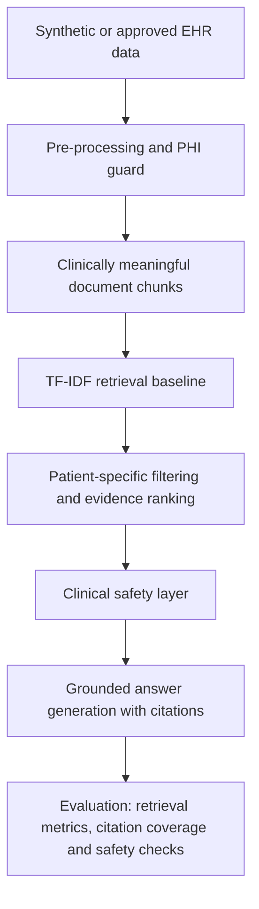

# Clinically Aware RAG for NHS-Style Electronic Health Records

[](https://github.com/mati-wiecek/msc-ai-data-science-projects/actions/workflows/portfolio-ci.yml)

This project implements a research prototype for clinically aware Retrieval-Augmented Generation over synthetic Electronic Health Record (EHR) snippets. It focuses on grounded retrieval, patient-specific evidence filtering, citation-aware answer generation and explicit safety boundaries for unsupported or clinically unsafe questions.

The current implementation uses synthetic records only. It is intended for research and portfolio demonstration, not for clinical use.

> Safety boundary: this repository is not a medical device, not a clinical decision-support system and must not be used with real patient data unless appropriate ethics, information governance, security, legal basis, approvals and data access agreements are in place.

## Results Snapshot

| Capability | Current evidence |
| --- | --- |
| Retrieval quality on synthetic qrels | Precision@3 `0.583`, Recall@3 `1.000`, MRR `1.000` |
| Patient-aware search | Retrieval can be filtered to a specific synthetic patient before answer generation. |
| Safety behaviour | Diagnosis, prescribing and treatment-instruction requests trigger constrained responses. |
| Engineering readiness | Installable Python package, `clinrag` CLI, `pytest` tests, Ruff configuration and CI workflow. |

Example CLI answer:

```text
clinrag demo "What medications is patient SYN-001 taking?"

Based on the retrieved synthetic EHR evidence, the record contains the following relevant information:
- [SYN-001-meds] medications: metformin, ramipril and atorvastatin are listed in the synthetic record.

The answer is limited to the cited evidence above; absence of evidence here does not prove absence in the full record.
```

## Research Aim

The aim is to investigate whether a RAG pipeline can answer EHR-grounded information needs more reliably when retrieval and generation are made clinically aware.

In this prototype, clinically aware means:

1. patient-specific context is filtered before ranking;
2. retrieved evidence is cited in the generated answer;
3. unsupported answers are handled cautiously;
4. unsafe or out-of-scope requests trigger a safety response;
5. evaluation includes retrieval quality, citation coverage and safety behaviour.

## Research Questions

- How can patient-specific filtering reduce wrong-record retrieval in EHR-style RAG?
- Can a lightweight TF-IDF baseline support grounded answers over synthetic clinical snippets?
- How should a clinical RAG prototype abstain when evidence is missing or a query requests diagnosis, prescribing or treatment instructions?
- Which evaluation metrics best capture retrieval quality, faithfulness and safety behaviour?

## Current Features

- Runnable Python package with a `clinrag` command-line interface.
- Synthetic FHIR-inspired EHR snippets and relevance labels.
- TF-IDF retrieval baseline with patient-aware filtering.
- Simple clinical safety layer for unsafe and out-of-scope requests.
- Template-based grounded answer generation with source citations.
- Retrieval evaluation using synthetic qrels.
- Unit tests for retrieval, safety and pipeline behaviour.
- Documentation covering methodology, data handling, ethics, evaluation and project risks.

## Repository Structure

```text
project-rag-nhs/
|-- configs/
|   `-- default.yaml
|-- data/
|   |-- raw/
|   |   `-- .gitkeep
|   `-- synthetic/
|       |-- synthetic_ehr_docs.jsonl
|       `-- synthetic_qrels.json
|-- docs/
|   |-- DATA_HANDLING.md
|   |-- ETHICS_AND_GOVERNANCE.md
|   |-- EVALUATION_PLAN.md
|   |-- METHODOLOGY.md
|   |-- PROJECT_PLAN.md
|   |-- REFERENCES.md
|   `-- RISK_REGISTER.md
|-- examples/
|   `-- example_questions.yaml
|-- src/
|   `-- clinrag/
|       |-- cli.py
|       |-- clinical_safety.py
|       |-- config.py
|       |-- data_loader.py
|       |-- data_models.py
|       |-- evaluation.py
|       |-- fhir_mapper.py
|       |-- generator.py
|       |-- preprocessing.py
|       |-- rag_pipeline.py
|       `-- retrieval.py
|-- tests/
|   |-- test_pipeline.py
|   |-- test_retrieval.py
|   `-- test_safety.py
|-- .env.example
|-- .gitignore
|-- Makefile
|-- pyproject.toml
|-- requirements-dev.txt
|-- requirements.txt
`-- SECURITY.md
```

## Quick Start

Create a virtual environment and install the package:

```bash
python -m venv .venv
.venv\Scripts\activate
pip install -r requirements.txt -r requirements-dev.txt
pip install -e .
```

Run the demo:

```bash
clinrag demo "What medications is patient SYN-001 taking?"
clinrag query --patient-id SYN-001 --question "Does the record mention allergies?"
clinrag evaluate
pytest
```

Expected behaviour: the system retrieves relevant synthetic EHR snippets and produces a cautious answer with citations. If the question requests diagnosis, prescribing or direct treatment instructions, the safety layer constrains the response.

## Architecture



## Evaluation

The prototype evaluates retrieval on synthetic relevance labels using:

- Precision@k;
- Recall@k;
- Mean Reciprocal Rank;
- citation coverage;
- unsafe-query handling;
- wrong-patient retrieval checks.

The current TF-IDF retriever is intentionally simple. It provides a transparent baseline for later comparison with BM25, dense retrieval, hybrid retrieval and clinically reranked retrieval.

## Data and Safety

No real patient records, NHS extracts, private notes, credentials or access tokens are included. The repository contains only synthetic EHR-style examples under `data/synthetic/`.

The `data/raw/` directory is intentionally empty. Restricted datasets, if ever used, should remain outside the public repository unless redistribution is explicitly permitted.

## Future Work

- Add BM25, dense and hybrid retrievers.
- Add structured clinical metadata reranking for resource type, section and timestamp.
- Extend the synthetic relevance set with harder negative examples.
- Add answer-level faithfulness scoring and unsupported-claim detection.
- Compare baseline RAG against clinically aware retrieval and safety variants.
- Evaluate on approved public or de-identified clinical datasets if governance permits.

## References

See [`docs/REFERENCES.md`](docs/REFERENCES.md) for technical, governance and dataset references.
