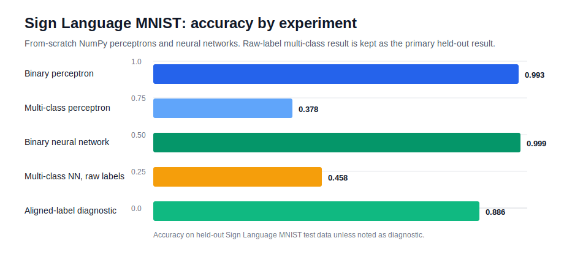

# Sign Language MNIST - Neural Networks from Scratch

[](https://github.com/mati-wiecek/msc-ai-data-science-projects/actions/workflows/portfolio-ci.yml)

This project studies image classification on the Sign Language MNIST dataset using models implemented from scratch in NumPy. The analysis compares a linear perceptron baseline with fully connected neural networks for binary and multi-class hand-sign recognition.

The main research focus is not only predictive performance, but also how model capacity, activation functions, optimisation choices and evaluation design affect classification behaviour on flattened image pixels.

## Research Questions

| Question | Method |
|---|---|
| How far can a linear perceptron go on flattened hand-sign images? | Binary C-vs-rest perceptron and one-vs-rest multi-class perceptron with step and sigmoid activations. |
| What changes when the model can learn non-linear representations? | Fully connected neural networks with sigmoid and ReLU hidden layers, trained with mini-batch gradient descent and backpropagation. |
| How should model outputs be evaluated beyond accuracy? | Accuracy, precision, recall, macro averages, confusion matrices and learning curves. |
| What explains the gap between raw and aligned multi-class test results? | A documented diagnostic comparing raw test labels with an aligned-label interpretation for the observed class-index compression issue. |

## Methods

- Perceptron learning implemented from scratch in NumPy.
- Online and full-batch training variants.
- Step and sigmoid activations.
- One-vs-rest multi-class classification.
- Feed-forward neural network implemented from scratch in NumPy.
- Backpropagation, mini-batch gradient descent, softmax and cross-entropy.
- ReLU, dropout, momentum, L2 regularisation, validation split and early stopping.
- Reproducible reporting of metrics and final run summaries.

## Repository Structure

```text
sign-language-mnist/
|-- notebooks/
|   |-- 01_perceptron_analysis.ipynb
|   `-- 02_neural_network_analysis.ipynb
|-- src/
|   |-- ann.py
|   |-- data_utils.py
|   |-- metrics.py
|   |-- perceptron.py
|   `-- plotting.py
|-- data/
|   |-- README.md
|   `-- raw/
|-- docs/
|   |-- methodology_report.md
|   `-- methodology_notes.md
|-- figures/
|   `-- results_summary.svg
|-- reports/
|   |-- final_run_results.md
|   `-- final_run_results.json
|-- requirements.txt
|-- environment.yml
|-- .gitignore
`-- README.md
```

## Results Summary

The notebooks were executed with local copies of `sign_mnist_train.csv` and `sign_mnist_test.csv`. The final recorded results are saved in `reports/final_run_results.md` and `reports/final_run_results.json`.



| Model / experiment | Best configuration | Main result |
|---|---:|---:|
| Binary perceptron: C vs rest | Step + online | Accuracy 0.9930, precision 0.9676, recall 0.8677 |
| Multi-class perceptron | Sigmoid + online OVR | Accuracy 0.3781, macro precision 0.3181, macro recall 0.3056 |
| Binary neural network | ReLU, 1 hidden layer | Accuracy 0.9986, precision 1.0000, recall 0.9677 |
| Multi-class neural network, raw test labels | ReLU `[512, 256]` | Accuracy 0.4584, macro precision 0.3976, macro recall 0.3823 |
| Multi-class neural network, aligned-label diagnostic | ReLU `[512, 256]` | Accuracy 0.8862, macro precision 0.8693, macro recall 0.8524 |

The raw-label result is reported as the primary held-out result because it uses the test file exactly as provided. The aligned-label diagnostic is included to investigate the apparent class-index compression in the test labels from class 10 onward.

## Setup

```bash
python -m venv .venv

# macOS/Linux
source .venv/bin/activate

# Windows PowerShell
# .venv\Scripts\Activate.ps1

pip install -r requirements.txt
python -m ipykernel install --user --name cs802-sign-language --display-name "CS802 Sign Language"
jupyter lab
```

Open the notebooks in order:

1. `notebooks/01_perceptron_analysis.ipynb`
2. `notebooks/02_neural_network_analysis.ipynb`

## Data

The dataset files are not included in this repository. Place the following CSV files in `data/raw/`:

```text
data/raw/sign_mnist_train.csv
data/raw/sign_mnist_test.csv
```

The notebooks also work if the CSV files are placed in the same folder from which the notebook is executed.

## Data and Reproducibility Note

This repository contains reproducible analysis code, executed notebooks and summary reports. Raw dataset files, local cache files and private course materials are intentionally excluded.
